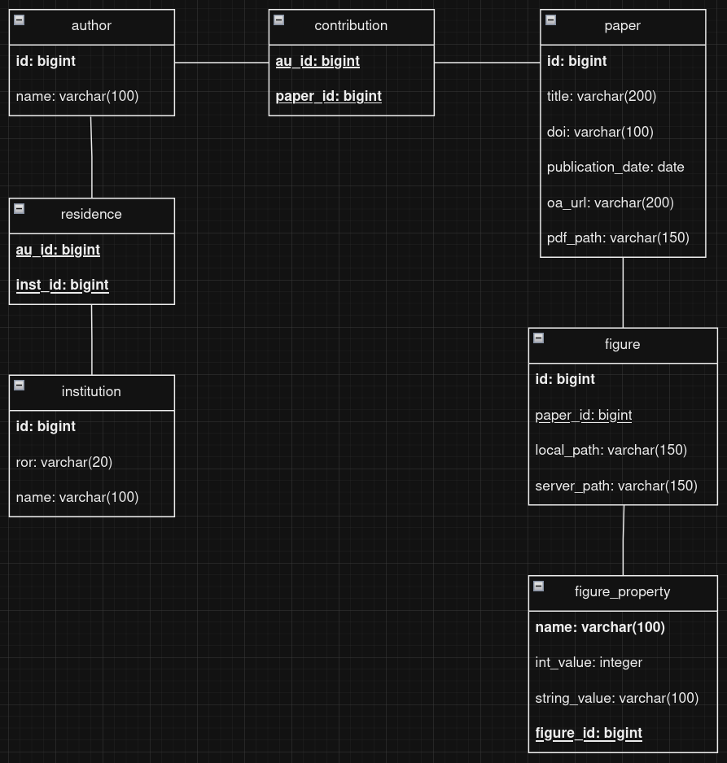
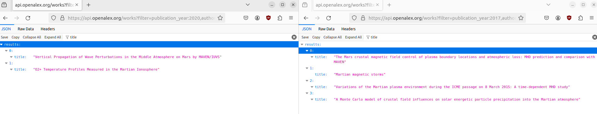
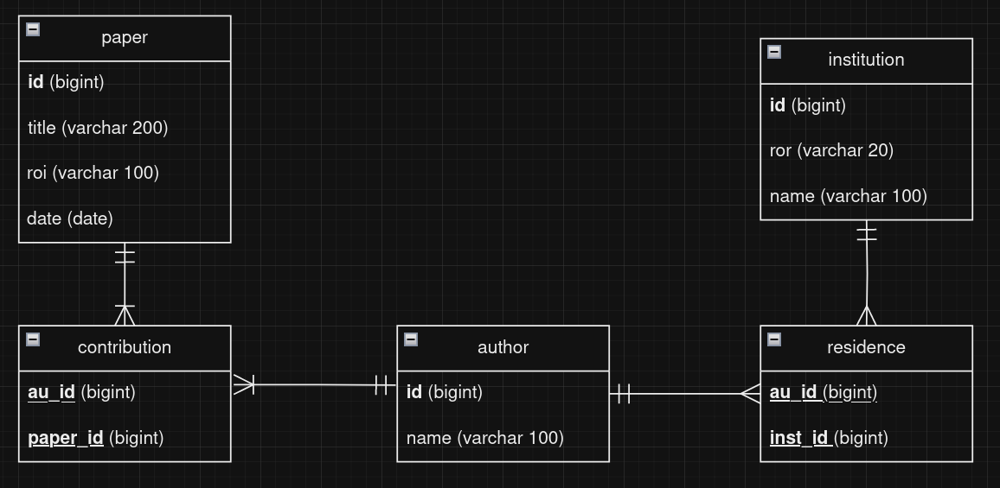

# Database Information

## Latest Database File

[publications.db](database_information/publications.db)

/page

## Entity Results Diagram



- [draw.io](http://draw.io) file:
    
    [publication_database_er.drawio](database_information/publication_database_er.drawio)
    

## Database Code

The code to create and populate the database is in the GitHub repo.

Creating:

https://github.com/DevinBayly/vis-sieve/blob/main/database/create_database.py

Filling:

https://github.com/DevinBayly/vis-sieve/blob/main/openalex_code/hear_me_ROR_script.py

Note that filling the database right now is incredibly slow, I think from stripping PDFs and figures. 

# Local File Structure

- content
    - [paper id]
        - pdf file (paper_id.pdf)
        - figures
            - [figures indexed by integer 00-99] (.png/.jpg/etc.)

Notes:

Add paper properties, like topics 

Note, rn a paper is connected to an institution only by author. If an author worked at the uofa then went somewhere else, all their works would be counted under both uofa and the other place. Is that an issue? 

affiliation is a author attribute that has some possible time associated with it, [https://docs.openalex.org/api-entities/authors/author-object](https://docs.openalex.org/api-entities/authors/author-object), 

digging into this

 [https://api.openalex.org/authors?filter=affiliations.institution.ror:03m2x1q45+00hx57361](https://api.openalex.org/authors?filter=affiliations.institution.ror:03m2x1q45+00hx57361) would be someone with both princeton and UA affiliation [https://openalex.org/authors/A5072674162](https://openalex.org/authors/A5072674162) for example. This person was at u of  a in 2020 and princeton plasma in 2017

look at the results with these two queries to see if there’s the overlap we were afraid of

then we can look for their works in 2020, assumption is that they would also show up in the institutional pass for 2020 from u of arizona. 

[https://api.openalex.org/works?filter=publication_year:2020,authorships.author.id:A5072674162,authorships.institutions.ror:03m2x1q45](https://api.openalex.org/works?filter=publication_year:2020,authorships.author.id:A5072674162,authorships.institutions.ror:03m2x1q45)

then if we look for works in 2017 we will see the ones from princeton, 

[https://api.openalex.org/works?filter=publication_year:2017,authorships.author.id:A5072674162,authorships.institutions.ror:00hx57361](https://api.openalex.org/works?filter=publication_year:2017,authorships.author.id:A5072674162,authorships.institutions.ror:00hx57361)

no overlap



or are we talking about a case where an user queries the database for the works of a particular author? problem statement is u of a work counts being correct vs

suggestion is that we auto populate a field on paper that just borrows the ROR that is provided when the publication by year process is going

## Database Subset and SQL Practice



It's not a super big file so I’ll just put it here, note there are no figures yet so no need to worry about file structure.

[publications.db](database_information/publications 1.db)

- Code to generate database
    
    ```sql
    CREATE TABLE author (
        id BIGINT PRIMARY KEY,
        name VARCHAR(100) NOT NULL
    );
                
    CREATE TABLE institution (
        id BIGINT PRIMARY KEY,
        roi VARCHAR(20) NOT NULL,
        name VARCHAR(100) NOT NULL
    );
                
    CREATE TABLE residence (
        au_id BIGINT,
        inst_id BIGINT,
        PRIMARY KEY (au_id, inst_id),
        FOREIGN KEY (au_id) REFERENCES author(id),
        FOREIGN KEY (inst_id) REFERENCES institution(id)
    );
                
    CREATE TABLE paper (
        id BIGINT PRIMARY KEY,
        title VARCHAR(200) NOT NULL,
        doi VARCHAR(100),
        publication_date DATE
    );
                
    CREATE TABLE contribution (
        au_id BIGINT,
        paper_id BIGINT,
        PRIMARY KEY (au_id, paper_id),
        FOREIGN KEY (au_id) REFERENCES author(id),
        FOREIGN KEY (paper_id) REFERENCES paper(id)
    );
                
    CREATE TABLE figure (
        id INTEGER PRIMARY KEY,
        paper_id BIGINT,
        local_path VARCHAR(100),
        server_path VARCHAR(100),
        FOREIGN KEY (paper_id) REFERENCES paper(id)           
    );
                
    CREATE TABLE figure_property (
        name VARCHAR(100),
        int_value INTEGER,
        string_value VARCHAR(100),
        figure_id INTEGER,
        FOREIGN KEY (figure_id) REFERENCES figure(id),
        PRIMARY KEY (name, figure_id)
    );
    ```
    
    If you want to use ChatGPT, I’d recommend something along the lines of 
    
    ```
    Below is the code to generate an SQL database:
    [All the code above]
    END OF SQL CODE
    
    Write a query to [find the number of authors]
    ```
    
    But feel free to see what works for you
    

Some information to note:

- Each block is called a table, each variable is called a column
- Common data types
    - Bigint is an int64 (some openalex ids were bigger than the int32 cap)
    - Date is a date that's always formatted like “yyyy-mm-dd”
    - Varchar is short for variable (number of) characters and can have between 0 and the number of characters listed
- Keys
    - Items in bold are primary keys, meaning every entry must have this property and there cannot be duplicates of it. For example, author has a primary key **id**, meaning every author in the table has an id, and no two authors share an id. For paper, institution, and author, this is the id specified by openalex.
        - Note that a paper, an author, and an institution may have the same id, open alex gets around this by appending an “W” (work), “A”, or “I” before the id.
        - If a table has multiple columns in bold, that means those columns form a composite primary key, meaning none of the composite columns can be NULL, and every entry must be a unique combination of the columns. In the example above, each contribution entry must have both an author and a paper, and no two entries can share the same combination of author and paper. (001, 333) and (001, 444) would be okay, (001, 333) and (002, 333) would be okay, but (001, 333) and (001, 333) would not be okay.
    - Columns that are underlined are called foreign keys, meaning they reference the primary key of another table. For example, contribution.au_id references author.id.
- The lines (less important)
    - The lines between each table don't actually represent anything in the database, just concepts. Lines terminating in the double bars represent “only one” while the “|<” means one or more, and “<” means any number. For example, in the above diagram, each author can have one or more contribution, but each contribution can only reference one author.
    

### Getting started with DuckDB

Id recommend using it with python so it'll integrate with any other work we do, but that's of course up to you, there's documentation on their website if you wanna do it a different way. It can be installed pretty easily with pip.

```bash
pip install duckdb
```

Next, in python, you'll want to import it. I don't think there's a common import name but I've just been calling it `db`

```python
import duckdb as db
```

Then, any time you want to use the database, you'll open it, run the queries followed by fetching, then close it.

```python
con = db.connect('publications.db')
# Gets the number of papers
con.execute("""
						SELECT COUNT(*)
						FROM paper
						""")
print(con.fetchall())

# Gets all unique institution names
con.execute("""
						SELECT DISTINCT name
						FROM institution
						""")
print(con.fetchall())
con.close()
```

Theres a lot of good resources for info on SQL, one I like is [https://www.w3schools.com/sql](https://www.w3schools.com/sql)

### Queries to try

Here’s a couple of questions to try to answer by querying the database

- How many institutions are in the database?
    
    ```sql
    SELECT COUNT(*)
    FROM institution
    ```
    
- What is the name of the institution with `id=20089843` ?
    
    ```sql
    SELECT name
    FROM institution
    WHERE id = 20089843
    ```
    
- What are all the institutions that have “Arizona” in the name? (Hint: use `LIKE`)
    
    ```sql
    SELECT name
    FROM institution
    WHERE name LIKE '%Arizona%'
    ```
    
- Who are three authors from “Princeton University”?
    
    ```sql
    SELECT author.name 
    FROM author
    JOIN residence 
        ON author.id = residence.au_id
    JOIN institution
        ON residence.inst_id = institution.id
    WHERE institution.name = 'Princeton University'
    LIMIT 3
    ```
    
    Note that indentation and new lines are not important, just the words. You could put that all on one line and it would work.
    
- What are the titles of all the papers coauthored by people affiliated with “Princeton University”
    
    ```sql
    SELECT DISTINCT paper.title
    FROM paper
    JOIN contribution ON paper.id = contribution.paper_id
    JOIN author ON contribution.au_id = author.id
    JOIN residence ON author.id = residence.au_id
    JOIN institution ON residence.inst_id = institution.id
    WHERE institution.name = 'Princeton University'
    ```
    
- How many papers are there that have no authors affiliated with the “University of Arizona”
    
    *Incorrect from ChatGPT:*
    
    ```sql
    SELECT COUNT(DISTINCT p.id) 
    FROM paper p
    LEFT JOIN contribution c ON p.id = c.paper_id
    LEFT JOIN residence r ON c.au_id = r.au_id
    LEFT JOIN institution i ON r.inst_id = i.id
    WHERE i.name IS NULL OR i.name != 'University of Arizona';
    ```
    
    This will get all the papers that have anyone unaffiliated with the UofA, rather than everyone unaffiliated.
    
    After another prompt reminding it of its goal
    
    *Correct from ChatGPT:*
    
    ```sql
    SELECT COUNT(*)
    FROM paper
    WHERE id NOT IN (
        SELECT DISTINCT paper_id
        FROM contribution
        JOIN residence ON contribution.au_id = residence.au_id
        JOIN institution ON residence.inst_id = institution.id
        WHERE institution.name = 'University of Arizona'
    );
    ```
    
    It’s weird that the answer is 27 (you can verify by manually looking through the db) as the whole point of this query is to find papers affiliated with the U of A. Looking into it, the issue is with the database creation and not adding all of an author's affiliations, the query works correctly. I’ll patch this but at least for the DB file above, this makes for a good exercise. 
    

[support@openalex.org](mailto:support@openalex.org)